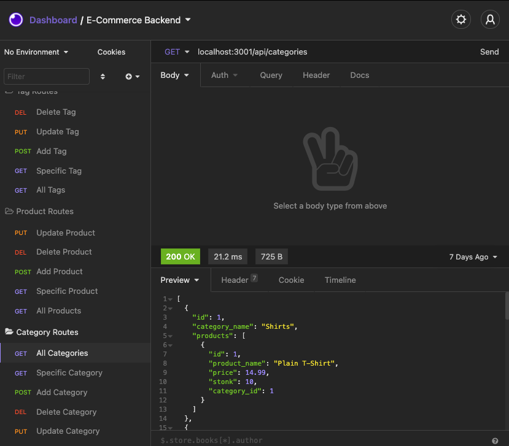
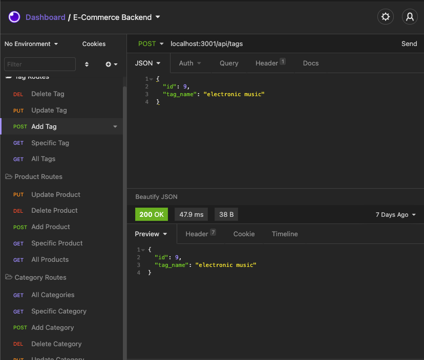

# E-Commerce Backend

## Backend code designing the RESTful API of an e-commerce site

## Table of Contents

- [Installation](#Installation)
- [Usage](#Usage)
- [Credits](#Credits)
- [License](#License)

## Installation

Install the Following Dependencies:
Dependencies are included in the package.json, so just run npm install in the terminal to get everything set up

The default port for the server is 3001. This can be changed if you want, but make sure you direct the api call to the correct location

## Usage

## Credits

Matt Reisdorf:
Github - [MattReisdorf](https://github.com/MattReisdorf)

Jeremy Joanet:
Github - [Vygoth](https://github.com/Vygoth)

Tom Siemion:
Github - [rotosti](https://github.com/rotosti)

Zach Duty:
Github - [Zachduty](https://github.com/Zachduty)

## License

The Unlicense

http://unlicense.org/

